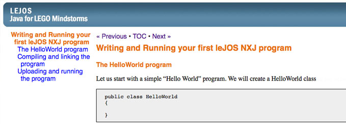

###### Course: §126.40

## Robotics Programming and Design 

TechApps in Texas has six main strands based on the National Education Technology Standards and performance indicators based on the International Society for Technology in Education;  creativity and innovation; communication and collaboration; research and information fluency; critical thinking, problem solving, and decision making; digital citizenship; and technology operations and concepts. These are found across the different Tech Apps courses in Texas, including Robotics Programming & Design.

Robotics Programming and Design will foster students' creativity and innovation by presenting opportunities to design, implement, and present meaningful robotic programs through a variety of media. Students will collaborate with one another, their instructor, and various electronic communities to solve problems in designing and programming robots. Through data analysis, students will identify task requirements, plan search strategies, and use robotic concepts to access, analyze, and evaluate information needed to solve problems. By using robotic knowledge and skills that support the work of individuals and groups in solving problems, students will select the technology appropriate for the task, synthesize knowledge, create solutions, and evaluate the results. Students will learn digital citizenship by researching current laws and regulations and by practicing integrity and respect. Students will gain an understanding of the principles of robotics through the study of physics, robotics, automation, and engineering design concepts.
 
#### Course Content

The course will focus on two main areas. In the fall semester, prototyping a task-oriented robot for reliability and consistancy, and designing and programming a novel in the spring semester. Throughout the year, the course will require students to collaborate, plan, and document their group's and robot's progress and development. Texas considers this a fourth year course. 

The course does not require previous experience, but it certainly helps. Students without prior experience will likely need to expect a large amount of work to be completed throughout the duration of the course. Prior courses that help prepare students for Robotics are Intro to Robotics & Intro to CS at 8th grade, and Fundamentals and other Computer Science courses in high school. Other tech courses, including Digital Communications, Web Design, and Digital Art can also help prepare students to a lesser extent.
 
We will work with the NXT robots, utilizing the LeJOS firmware and library. Our primary IDE will be IntelliJ IDEA from JetBrains. Through this course, you will gain experience in both programming with Java and in small-scale engineering.
 
#### Lab Hours

Lab hours available for extra time or additional help. If you need guidance, please schedule an appointment. If you just need extra work time, pop-ins are allowed. If you choose not to work in class and are a distraction to others, and then ask to come in for extra time, you will likely be denied extra time. You should make use of the time you already have in scheduled class before requesting more.

Before School: Tuesday - Thursday
* 7:15 - 7:45 am

Lunch: A Days Only
* 12:55 - 1:30 pm

After School: Monday, Tuesday, & Thursday
* 3:15 - 4:00 pm

If you need other accommodations, please see your instructor to make an appointment.

#### Robotics Course Content
 
This course introduces programming robots with a professional level IDE using raw code in the Java language. It is beneficial if students come into the course with some pre-existing knowledge. If students are not already comfortable with computers, they may find this course difficult. It would be beneficial to do well in Digital Communications, Computer Science 1, Fundamentals of Computer Science, Intro to Computer Science, or Intro to Robotics before taking this course.

Our Robotics Programming & Design course is designed to be an introduction into the ideas and fundamentals of robotics for students with limited background in programming and little or no background in robotics. Students are expected to have previous knowledge of computers in general, and should be able to utilize basic everyday software and operating systems. Throughout the course, students will have to work both individually and with different groups of their peers. Students who choose not to do one or the other will struggle to score acceptable marks. No background in specialized software is required.

Our introductory Robotics course spans across 2 semesters. The course is broken up into 2 massive units.

**Fall Unit: Prototyping & Engineering**
* What is a Robot?
* How to Program a Robot
* Sketching & Documentation
* The Importance of Reliability
* Proving and Defending

**Spring Unit: Animatronics & Imitation**
* Imitating Life
* Integrating Tech into Life
* Stimulus & Response
* Analyzing Behavior
* Artificial Intelligence

Students often expect Robotics to be an easy course. Technically, it is not a hard course. However, students are often used to being told the answer, or able to just find the answer. Robotics is a course that requires students to design, document, and create their own answers, then defend those answers. Due to how limited this is in the American education system, it is not unusual for students to find the class difficult due to having to work and think in a way they are not used to. In addition, students will be accountable both as an individual and as a group member, which some students also struggle with.
 
Students will likely work within several different programming environments during the year, making use of both visual programming and hand coding. Due to the amount of time designing and engineering the robot itself, there will be significantly less coding in this course than in Computer Science and Web Design. If you are interested in programming, it is recommended that you consider enrolling in Computer Science instead of, or in addition to, Robotics.
 
##### A bit of reading material:
- [What We Can Learn from Robots](https://www.technologyreview.com/s/403545/what-we-can-learn-from-robots/)
 
#### Style of Instruction:
Majority of content will be delivered through video instruction. This allows you to revisit content as often as you need, as well as to be able to slow down, speed up, or repeat content as often as you need. This also allows your instructor to work with and help students or groups of students when they need, without stopping the content for the rest of students.
 
As you are able to work at your own pace, this can sometimes cause a general slowdown for some students. Despite being able to watch videos whenever you need, it is important that you keep up with the pace of the course to not end up with a ton of backwork to complete at the midterm or at term's end.

#### Cheating & Academic Dishonesty

##### Copyright & Intellectual Property:

All forms of academic dishonesty and cheating are taken seriously. Some forms of cheating and academic dishonesty are more self-explanatory than others. When it comes to art, many students struggle with understanding intellectual property. As such, it is generally recommended to avoid using copyrighted materials without first discussing it with your instructor.
 
Many students are under the belief that if it is for education, copyright and intellectual property laws don't apply. This is not the case. Many companies choose not to file charges when copyright or intellectual property laws are violated for educational use, but some companies do, and this doesn't mean they can't choose to at a later point in time. Use of other's works as your own, without proper documentation can result in loss of credit. However, use of copyrighted material can also result in legal issues in addition to any academic woes.
  
##### A bit of reading material:
- [Copyright Crash Course](http://guides.lib.utexas.edu/copyright)
- [10 Big Myths About Copyright Explained](https://www.templetons.com/brad/copymyths.html)

##### Collaboration vs Collusion:

All forms of academic dishonesty and cheating are taken seriously. Some forms of cheating and academic dishonesty are more self-explanatory than others. The form of academic dishonesty that seems to confuse students is collusion. Collusion is providing or receiving unauthorized aid or assistance. What is or isn't authorized can vary from course to course, so it is important that you communicate with, and understand the expectations of, your instructor.
 
Research, as well as personal experience, shows that students tend to understand content better when working with and discussing content with other students. Some assignments will actually require it. However, it is important that the aid and assistance you receive, or that you provide, is authorized. If you are physically touching another student's keyboard, mouse, or sending complete or partial chunks of code, you are likely engaging in collusion, not collaboration. If unsure, it's better to ask. Collusion is a form of academic dishonesty and can result in loss of credit for all parties involved.
  
##### A bit of reading material:
- [Crossing the Line: Collusion or Collaboration...](https://files.eric.ed.gov/fulltext/EJ1004398.pdf)
- [Robert College's Collaboration Guidelines](http://webportal.robcol.k12.tr/Academics/Academic-Honesty/CollaborationGuidelines/Pages/default.aspx)
 
#### CMS / LMS:
We will use ManageBac.
